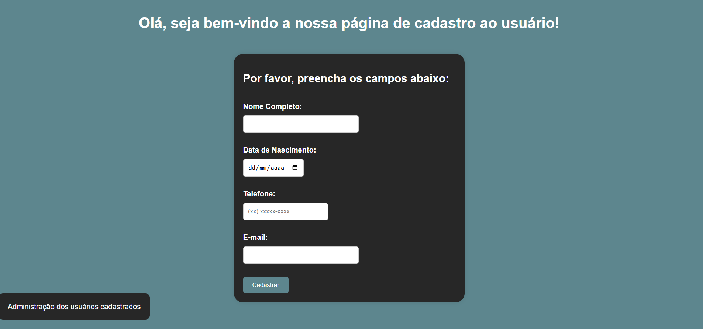

# Sistema de Gerenciamento de Usuário

### Descrição
  Este projeto implementa um sistema de gerenciamento de usuários. Ele permite cadastrar, consultar e deletar usuários, armazenando os dados diretamente no localStorage do navegador para persistência de informações.
***
### Como Utilizar

  1. Clone este repositório utilizando o comando:

      `git clone <URL DO REPOSITÓRIO>`

  2. Utilize uma ferramenta como o Live Server no Visual Studio Code para iniciar o projeto.

***
### Tecnologias Utilizadas
  HTML: Estruturação da página e dos formulários.

  CSS: Estilização da página e dos formulários.

  JavaScript: Lógica de captura dos dados, manipulação do DOM, e interação com o localStorage.

***
### Funcionalidades
  1. Cadastro de Usuários: Os usuários podem ser cadastrados preenchendo um formulário com os seguintes campos:

    - Nome
    - Data de Nascimento
    - Telefone
    - E-mail

  2. Armazenamento Local: Os dados dos usuários cadastrados são armazenados no localStorage do navegador, garantindo que as informações persistam após o fechamento ou recarregamento da página.

  3. Consulta de Usuários: O sistema permite consultar usuários cadastrados, fornecendo as informações de nome, data de nascimento, telefone e e-mail. O usuário pode buscar por e-mail e, caso encontrado, as informações são exibidas.

  4. Deleção de Usuários: O sistema também oferece a funcionalidade de excluir um usuário cadastrado, removendo seus dados do localStorage. Para deletar, basta informar o e-mail do usuário .

  

  

***
### Tratativas de Input de Usuário
O sistema implementa diversas validações para garantir que os dados inseridos pelo usuário sejam coerentes, evitando erros de preenchimento e inconsistências no armazenamento. As principais tratativas são:

- Campos obrigatórios: o sistema impede o cadastro caso qualquer campo esteja vazio, solicitando o preenchimento completo.

- Validação de e-mail: o campo de e-mail deve conter os caracteres “@” e “.”, validando de forma básica se o formato é adequado.

- Validação do telefone: um padrão de expressão regular (REGEX) é utilizado para garantir que o número de telefone siga formatos brasileiros válidos, como (21) 99999-8888 ou 21999998888.

- Validação da data de nascimento: o sistema bloqueia datas futuras, assegurando que o usuário não informe um nascimento inválido.

- Nome e sobrenome: o nome informado deve conter ao menos duas palavras (nome e sobrenome), sendo que o primeiro nome deve ter no mínimo três letras.

Essas validações são realizadas antes do cadastro para garantir a integridade dos dados, melhorar a experiência do usuário e evitar o armazenamento de informações incorretas no localStorage.

***
### Dificuldades
  - LocalStorage: Inicialmente, houve dificuldade em compreender como o LocalStorage funciona e como utilizá-lo para armazenar e recuperar dados persistentes no navegador. Após pesquisa e testes, foi possível implementar a solução de maneira eficiente, garantindo que os dados fossem armazenados corretamente mesmo após recarregar a página.

  - Método Factory: O conceito do padrão de projeto Factory foi inicialmente difícil de entender, especialmente em relação à separação de responsabilidades e à criação dinâmica de objetos. No entanto, após estudar exemplos e realizar experimentos, consegui aplicar o padrão, tornando o código mais flexível e reutilizável.

  - Organização de Arquivos: A estruturação dos arquivos HTML, CSS e JS para manter um projeto modular e de fácil manutenção foi desafiadora. Decidir como organizar os componentes e scripts de forma a evitar duplicação e facilitar futuras atualizações exigiu tempo e refinamento.